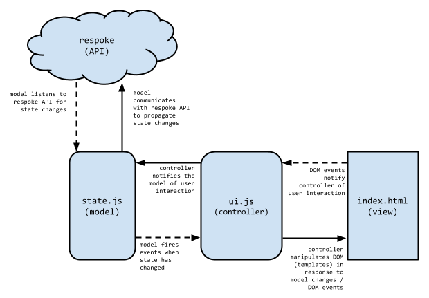

# Group Messaging

## Application Overview

The group messaging demo (/modules/group-messaging) is designed to demonstrate how to use the respoke API to message both individual users and users that are participating in a group chat.

### Logging in

To log in as a user, navigate to `/modules/group-messaging`. Enter a username (or an email address) and submit the form. You will be added to the "Everyone" group automatically and redirected to the main chat screen. You should see a buddy roster with the "Everyone" group listed on the left.

__HINT__: If you use an email address associated to a [gravatar](https://secure.gravatar.com) account, your gravatar will be displayed in the buddy and message lists!

Open another browser (or a private browsing window in your current browser) and repeat this process using a different username (or email address). You should see the "user" from each browser appear in the other browser window's roster. 


### Chatting with buddies

Click on a buddy in the roster to begin a chat session. A new tab will open at the top of the screen, and you will see a form appear at the bottom where you can enter a message to send to that user. When you send a message to another user it will open a tab in their browser window (if one is not already open) for your conversation.


Users may converse with more than one buddy at a time. A chat tab will be created for each conversation. Open another private browsing window (or launch a different browser) and log in as another user to have multiple conversations!

### Chatting in the "Everyone" group

The "Everyone" buddy is special. Sending a message to "Everyone" will open a chat tab for all users connected to the "Everyone" group. Since all users that log into this application are automatically joined to the "Everyone" group, sending a message to the group will open a chat tab in every browser. All users may participate in the "Everyone" chat.


## Application Architecture

The group messaging example application follows a simplified model-view-controller (MVC) architecture.



### The view

`index.html` contains script reference to all style sheets, library scripts, application modules scripts, and the respoke API script.

Markup is divided into several template `<script>` blocks which are read and manipulated by the `ui.js` module. Each template block contains a [Handlebars](http://handlebarsjs.com) template: HTML markup with special Handlebars syntax for injecting data.

A single element, `<div id="ui">` serves as the root HTML element for the application. When the `ui` module manipulates the page, it attaches rendered templates to this element.

### The ui controller (ui.js)

The `ui` controller manages all interaction with the DOM (view) and renders templates when necessary. It is composed of a number of submodules that each govern specific user interface components:

- `auth`: sets up authentication submodules
    - `authForm`: accepts login credentials
- `groupMessage`: sets up group messaging submodules
    - `menu`: shows and hides elements in responsive mode
    - `tabs`: creates, removes, and pulses tabs during chat
    - `messages`: displays messages for the active chat
    - `buddies`: begins user/group chats
    - `chatForm`: accepts input (messages) for the active chat

Each submodule listens to events from the application's `state` model and manipulates its specific DOM elements accordingly. Likewise, when DOM events occur, each submodule may invoke methods in the `state` model that will perform some operation (sending a message, for example). The `ui` controller does not hold any application data itself; it merely holds references to actual view objects (DOM elements).

All application data belongs to the `state` model. This means that, for example, when a new message arrives for a user, the view is notified and must request message data from the model in order to render the message template.

### The state model (state.js)

The `state` model contains both application logic and application data. It exposes a number of "public" methods which the `ui` controller may invoke, as well as a number of properties that contain data objects such as collections of buddies, messages, and tabs. When the `ui` controller invokes a method on the `state` model, it will typically execute some application logic, manipulate its data, then fire an event to let the controller know that its state has changed. It is also responsible for communicating with the respoke API when required.

### The respoke API

When the `index.html` page is loaded, it instructs the `state` model to initialize itself. (This occurs after all assets, styles, and scripts are loaded.) During initialization the state model creates a respoke `client` object, passing it the respoke application identifier and a flag that indicates that the application is operating in development mode.

```html
<script type="text/javascript">
    (function () {
        App.state.init('7c15ec35-71a9-457f-8b73-97caf4eb43ca');
    }());
</script>
```

```javascript
state.init = function (appId) {
    var connectionOptions = {
        appId: appId,
        developmentMode: true
    };
    state.client = respoke.createClient(connectionOptions);
    //...
};
```

The `state` model maintains a reference to the respoke `client` at all times. It uses this client object to communicate with the respoke services on behalf of the user. Before it can do this, however, the current user must log into the application and connect to respoke with a username (a respoke endpointId). When the user enters their information into the login form and clicks the `submit` button, the `controller` invokes the `login` method on the state model and a respoke connection is established for the `client` object.

```javascript
state.login = function (username) {
    return state.client.connect({
        endpointId: username,
        presence: 'available'
    }).done(function () {
        state.loggedInUser = username;
        state.client.listen('message', onMessageReceived);
        //...
    }, function (err) {
        // handle errors
    });
};
```

When the `client` connection succeeds, the `state` model begins listening to any `message` events raised by the `client` object--incoming messages from other users or from groups of which the current user is a member.

Once the user has successfully logged in, the controller updates the user interface and instructs the `state` model to populate the buddy list. The `state` model uses the `client` object to join the "Everyone" group, and then retrieves all members from this group to populate the buddy list.

```javascript
state.loadBuddies = function () {
    return state.client.join({id: 'Everyone'}).then(function (group) {
        state.fire('group.joined');
        var buddy = new GroupBuddy(group, false);
        addBuddy(buddy);
        state.everyoneGroup = group;
        state.everyoneGroup.listen('join', onGroupJoin);
        state.everyoneGroup.listen('leave', onGroupLeave);
        return state.everyoneGroup.getMembers().then(function (connections) {
            connections.filter(function (connection) {
                // ignore self
                return connection.endpointId !== state.loggedInUser;
            }).forEach(function (connection) {
                var buddy = new UserBuddy(connection, false);
                addBuddy(buddy);
            });
        }).then(function () {
            //...fire events
            //...handle errors
        });
    }, function (err) {
        //...handle errors
    });
};
```

Once the "Everyone" group has been joined, the `state` model holds a reference to the `group` object returned by the respoke API, assigning this object to the `everyoneGroup` property. It then creates a `GroupBuddy` object which will be added to the `buddies` collection. This allows the `ui` controller to "see" the group as a buddy which will then be rendered in the user interface's buddy list.

The `state` model then listens to the "Everyone" group's `join` and `leave` events which will be triggered when new members become or depart.

It is possible that other users have joined the "Everyone" group already, so the `state` model iterates over the group's members, looking for any that need to be added to the buddy list. It purposely ignores the user who is currently logged in. (Most users don't want to send themselves messages!) 

Once these steps are complete, the `state` model will raise events that tell the `ui` controller to refresh its buddy list so the user can see all available buddies.

