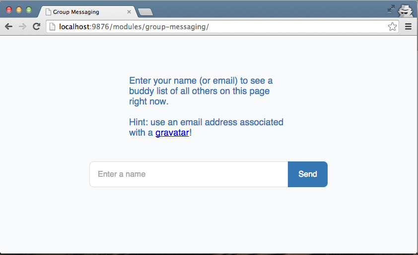
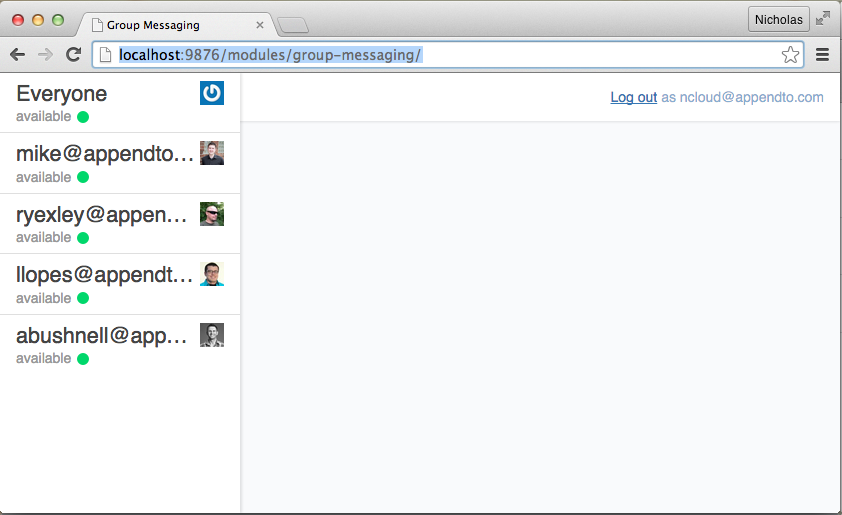
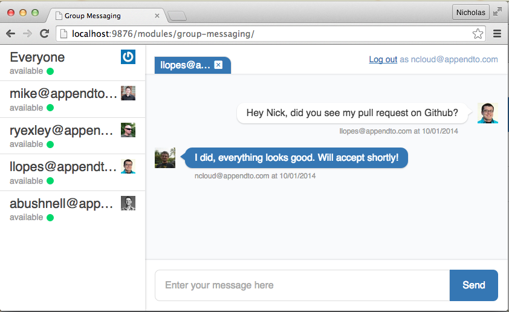
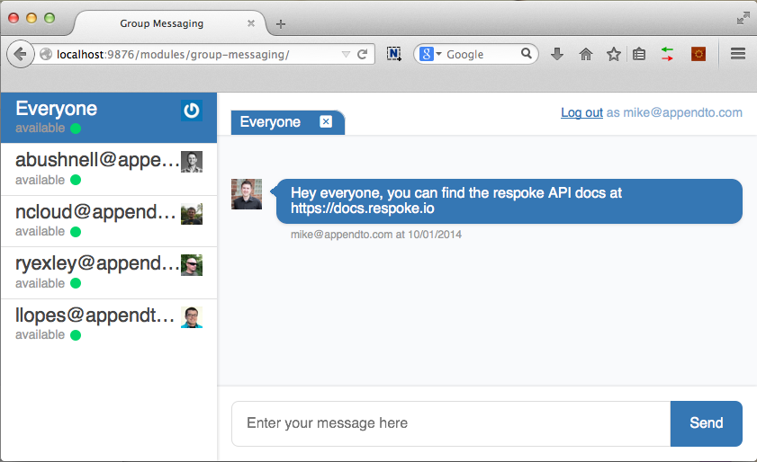
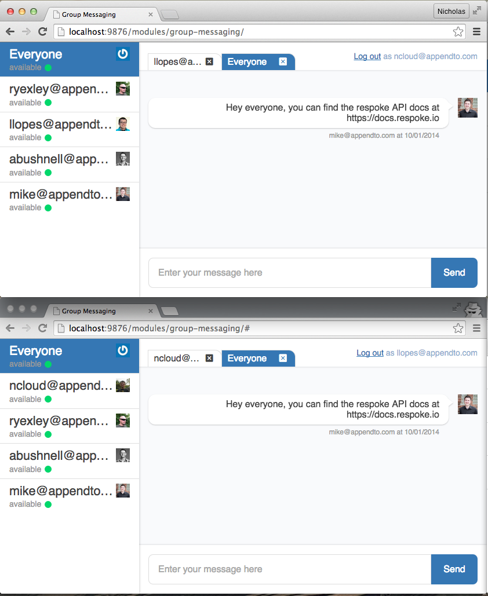

# Group Messaging

## Application Overview

### Logging in

### The buddy roster

### Chatting with buddies

### Chatting in the "Everyone" group

## Application Architecture

### The user interface module

### The state module

### The respoke API

